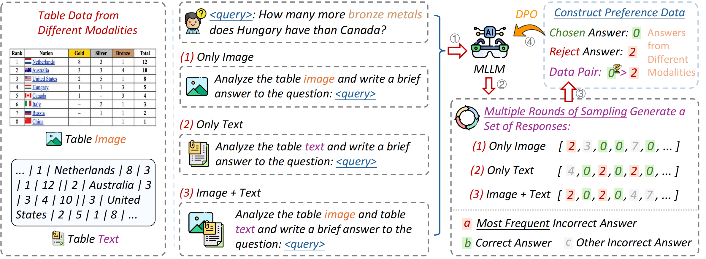

# HIPPO
Source code for paper: HIPPO: Enhancing the Table Understanding Capability of Large Language Models through Hybrid-Modal Preference Optimization

## Overview
We propose HIPPO, which represents tables using both text and image, and optimizes MLLMs to effectively learn more comprehensive table information from these multiple modalities.

Specifically, HIPPO samples model responses from hybrid-modal table representations and designs a modality-consistent sampling strategy to enhance response diversity and mitigate modality bias during DPO training.



## Environment Setup

Clone the repository

```
git clone https://github.com/NEUIR/HIPPO.git
cd HIPPO
```

Install Dependencies

```
conda create -n hippo python=3.10
conda activate hippo
pip install -r requirments.txt
```

## Data Preparation
Download the MMTab Image
```
# test
wget https://huggingface.co/datasets/SpursgoZmy/MMTab/resolve/main/MMTab-eval_table_images_23K.zip
mv MMTab-eval_table_images_23K.zip hippo/
unzip MMTab-eval_table_images_23K.zip

# train
wget https://huggingface.co/datasets/SpursgoZmy/MMTab/resolve/main/MMTab-instruct_table_images_82K.zip
mv MMTab-instruct_table_images_82K.zip
unzip MMTab-instruct_table_images_82K.zip
```

## Reproduce 

### Train HIPPO
You can download the checkpoint of HIPPO directly from [here](https://huggingface.co/HaolanWang/HIPPO) or go to the ``scripts`` and train the HIPPO model.

For training, you need to download the model [MiniCPM-V-2.6](https://huggingface.co/openbmb/MiniCPM-V-2_6) and [data](https://huggingface.co/datasets/HaolanWang/HIPPO). Then you can go to the ``scripts`` to construct DPO data.

```
cd scripts
bash construct_dpo_data.bash
```

Then you can train the model.

```
cd scripts
bash train.bash
```


### Inference HIPPO

For Inference, you can go to the ``scripts`` and inference on the HIPPO model: 
```
cd scripts
bash inference.sh
```
### Evaluation

For evaluation, you can use ``src/eval/MMTab_evaluation.ipynb`` to evaluate the performance.

## Contact
If you have questions, suggestions, and bug reports, please email:
```
wanghaolan@stumail.neu.edu.cn
```

## Citation
Please cite the paper and star the repo if you use HIPPO and find it helpful.
```
@misc{liu2025hippoenhancingtableunderstanding,
      title={HIPPO: Enhancing the Table Understanding Capability of Large Language Models through Hybrid-Modal Preference Optimization}, 
      author={Zhenghao Liu and Haolan Wang and Xinze Li and Qiushi Xiong and Xiaocui Yang and Yu Gu and Yukun Yan and Qi Shi and Fangfang Li and Ge Yu and Maosong Sun},
      year={2025},
      eprint={2502.17315},
      archivePrefix={arXiv},
      primaryClass={cs.CL},
      url={https://arxiv.org/abs/2502.17315}, 
}
```
